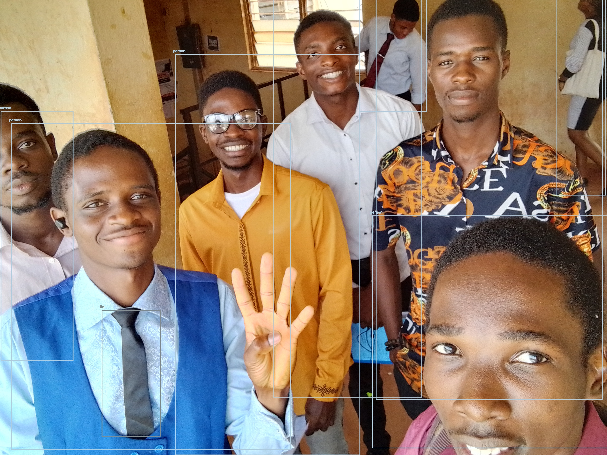

# Object-Detection-and-Light-Control-with-OpenCV

OpenCV `dnn` module supports running inference on pre-trained deep learning models from popular frameworks like Caffe, Torch and TensorFlow. 

When it comes to object detection, popular detection frameworks are
 * YOLO
 * SSD
 * Faster R-CNN
 
 Support for running YOLO/DarkNet has been added to OpenCV dnn module recently. 
 
 ## Dependencies
  * opencv
  * numpy
  * requests
  
`pip install Requests numpy opencv-python`

## OR

`pip intall -r requirements.txt`

 ## YOLO (You Only Look Once)

 ## YOLOV3

 ### Weights
 Download the pre-trained YOLO v3 weights file from this [link](https://pjreddie.com/media/files/yolov3.weights) and place it in the current directory or you can directly download to the current directory in terminal using
 
 `$ wget https://pjreddie.com/media/files/yolov3.weights`

 ### OR

 `wget https://pjreddie.com/media/files/yolov3-tiny.weights`  - For Constrained Environments:

 ## YOLOV4

### Weights
YOLOV4-tiny [weights](yolov4-tiny.weights) has already been included in this repository and used in the codes. So you don't have to download the weights.

## Testing

Provided all the files are in the current directory, below command will apply object detection on the input image `group.jpg`.
 
`$ python3 yolo_image_test.py -i group.jpg`

**Command format** 
 
 `$ python3 yolo_opencv.py -i [path to input image]` or `$ python3 yolo_opencv.py --image [path to input image]`
 
 
 ### Sample Output :
 

 ## Other Tests

 `python3 real_time_yolo_video.py -v [path to input video]` - Run object detection on the given video

 `python3 real_time_yolo_webcam.py` - Run object detection on live webcam feed

 `python3 real_time_yolo_esp32cam.py` - Run object detection on live ESP32 cam image frames served on `192.168.4.1/capture`

 ## Main Code Test

 The main code uses gets feeds from either the webcam or esp32 camera and uses it to run the object detection in search for persons. When it detects a person it would call a route to the camera server which will reset the counter responsible for dimming or deactivating the lights in the room where it is located. When no person is found withing a 30 seconds period, the light will dim and then go OFF when persons are still not detected after another 30 seconds. However, in the case of darkness where the camera can no longer "see", the device will use an onboard pir motion sensor to detect motion and turn ON the lights then try to verify if it was a person before turning it OFF again.

 `python3 main.py` - Run main code using ESP32 camera as source and without showing feed with detection.

 `python3 main.py -c true` - Run main code using web camera as source and without showing feed with detection.

 `python3 main.py -o true` - Run main code using ESP32 camera as source and show output feed with detection.

 `python3 main.py -c true -o true` - Run main code using web camera as source and show output feed with detection.

 In each case of the above commands, the computer used to run the program must be connect to the ESP32 camera's local WiFi hotspot whose parameters are:

 ### **SSID - `YOLO32-CAM`**
 ### **PSWD - `YOLOV3-2024**

 
